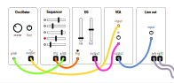

# Finite Tone

This is one of the most basic patches in modular synthesis. The result is a tone that has a distinct beginning and end with the optional ability to create a specific pitch.

Along with a module to hear the result, you will need:

1. A voice. An oscillator, a filter capable of self-oscillation, or a any module that can generate a constant audio rate signal (e.g. a looping sampler).
2. An envelope generator. This only needs to have a trigger input and an output, although most will have a way to control the rise and fall of the envelope either using CV or physically with knobs/faders.
3. A VCA. Any voltage controlled amplifier/attenuator should do.
4. A trigger source. Typically a sequencer is used, but a clock source will also work (e.g. a clock divider or euclidean module). A lot of envelope generators also have a physical button you can press to create a trigger.

This is a diagram of the final patch

Step 1: Create a drone

Patch the output of your voice module to the input of your VCA and the output of your VCA to the output module that sends the signal to your speakers. You should now hear the constant sound of your voice module through your speakers. If your VCA has a knob to control the amplitude of the output signal (most do), you can use it to adjust the volume.

Step 2: Control the VCA with the envelope

Patch the output of the envelope generator to the CV control of the VCA. You will probably stop hearing sound now because your envelope isn't sending any control voltage. For it to do that, you need to trigger it.

Step 3: Trigger the envelope generator

Patch the output of your trigger source to the trigger input of your envelope generator. Now each time the trigger fires, your envelope generator will send CV to your VCA to open it up in a specific way based on the attack/rise and sustain/fall of your envelope generator. Adjust these settings while continuing to send triggers and notice how it changes the duration of the tone.
